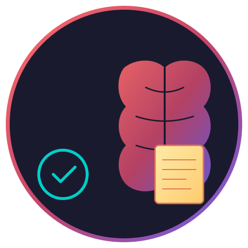

# Braindump



Braindump - dump your brain, not your productivity

Braindump is a macOS command-line interface (CLI) and Model Context Protocol (MCP) server for Apple Notes and Reminders. It allows you to quickly manage your notes and tasks directly from the terminal or through AI agents.

## Requirements

- macOS 26+ (Tahoe)
- Swift 6.2+

## Installation

### From Source

Clone the repository and build using Swift Package Manager:

```bash
git clone https://github.com/yourusername/Braindump.git
cd Braindump
swift build -c release
```

The binary will be available at `.build/release/braindump`. You can move it to your PATH:

```bash
cp .build/release/braindump /usr/local/bin/
```

## CLI Usage

### Apple Notes

List all notes:
```bash
braindump notes list
```

Create a new note:
```bash
braindump notes create --title "Meeting Notes" --body "Discuss project timeline." --folder "Work"
```

Search notes:
```bash
braindump notes search "timeline"
```

Get note content by ID:
```bash
braindump notes get <note-id>
```

### Reminders

List pending reminders:
```bash
braindump reminders list
```

Create a new reminder:
```bash
braindump reminders create --title "Buy groceries" --due "2026-01-05 18:00" --notes "Milk, Eggs, Bread" --priority 5
```

Complete a reminder:
```bash
braindump reminders complete <reminder-id>
```

## MCP Server Setup

Braindump can run as an MCP server, enabling AI agents (like Claude Desktop) to interact with your Apple Notes and Reminders.

### Configuration for Claude Desktop

Add the following to your `claude_desktop_config.json`:

```json
{
  "mcpServers": {
    "braindump": {
      "command": "braindump",
      "args": ["mcp", "serve"]
    }
  }
}
```

### Available MCP Tools

The server exposes 13 tools for managing notes and reminders:

1.  **notes_list**: List all notes. Optional parameter: `folder` (string) to filter by folder name.
2.  **notes_get**: Get a note by ID. Required parameter: `id` (string).
3.  **notes_create**: Create a new note. Required: `title` (string). Optional: `body` (string), `folder` (string, default 'Notes').
4.  **notes_search**: Search notes by title or content. Required parameter: `query` (string).
5.  **notes_delete**: Delete a note by ID. Required parameter: `id` (string).
6.  **notes_folders**: List all note folders with note counts.
7.  **reminders_list**: List reminders. Optional: `list` (string) to filter by list name, `include_completed` (boolean, default false).
8.  **reminders_get**: Get a reminder by ID. Required parameter: `id` (string).
9.  **reminders_create**: Create a new reminder. Required: `title` (string). Optional: `list` (string), `due_date` (ISO8601 string), `notes` (string), `priority` (int 0-9).
10. **reminders_complete**: Mark a reminder as completed. Required: `id` (string). Optional: `undo` (boolean) to uncomplete.
11. **reminders_delete**: Delete a reminder by ID. Required parameter: `id` (string).
12. **reminders_search**: Search reminders by title. Required parameter: `query` (string).
13. **reminders_lists**: List all reminder lists with pending counts.

## License

This project is licensed under the MIT License.
